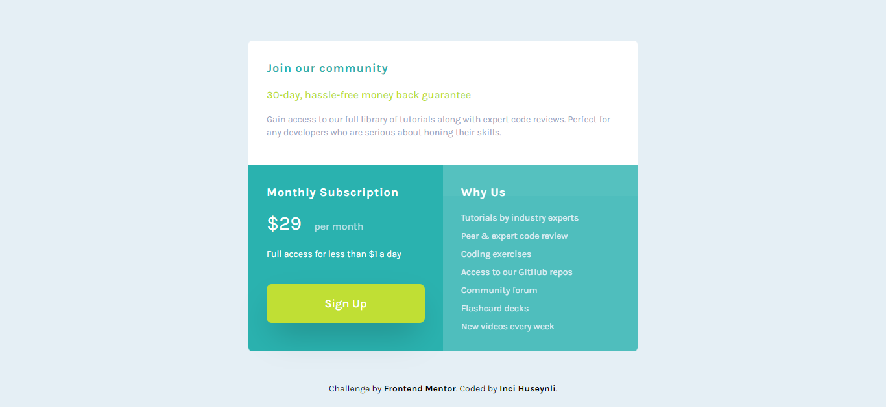

# Frontend Mentor - Single price grid component solution

This is a solution to the [Single price grid component challenge on Frontend Mentor](https://www.frontendmentor.io/challenges/single-price-grid-component-5ce41129d0ff452fec5abbbc). 

## Table of contents

- [Overview](#overview)
  - [The challenge](#the-challenge)
  - [Screenshot](#screenshot)
  - [Usage](#usage)
- [My process](#my-process)
  - [Built with](#built-with)
  

## Overview

### The challenge

Users should be able to:

- View the optimal layout for the component depending on their device's screen size
- See a hover state on desktop for the Sign Up call-to-action

### Screenshot

## Usage
To be able to use or work with this project you should open Terminal inside this projects file. After that add the following line of code to the terminal(this way Tailwind CSS will work properly throughout the project):

     npx tailwindcss -i ./src/input.css -o ./dist/output.css --watch

## My process

### Built with

- Semantic HTML5 markup
- Tailwind CSS
- Flexbox
- CSS Grid
- Mobile-first workflow
